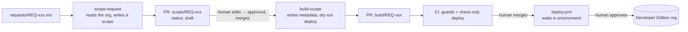

# Salesforce Admin Agent

A Claude Code agent that takes a client request, scopes it against a Salesforce org, turns the
**human-approved** scope into metadata, and opens a pull request that CI proves with a
check-only deploy. A human approves the scope, a human merges the build, a human approves the
deployment. No production org is reachable from anywhere in this repository.

Built as a portfolio piece by [Jason Treacy](https://github.com/jasontreacy). The target is a
free Developer Edition org seeded with a fictional retailer, **Lakeside Outfitters**. Every
ticket, person and record is invented.

<!-- live-links -->

## What it does



**Phase 1 — scope.** The agent reads the ticket, triages it (config / standard build / bug / too
big), inspects the org read-only with the `sf` CLI, and writes a scope in two registers: a
PLAIN ENGLISH briefing for the approver, and a CONCEPT / TASKS / CONSIDERATIONS / OUTCOMES block
for whoever builds it. It opens that as a pull request with `status: draft`.

**Phase 2 — build.** From a scope that a person has marked `approved` on `main`, the agent writes
the metadata, checks it against the scope's declared metadata types, runs a `--dry-run` deploy
and asserts the API said `checkOnly=true`, and opens a build PR. CI repeats every check from the
base branch's point of view and posts the validation result. Merging does not deploy; a separate
workflow waits for a named human to approve in a GitHub environment.

## The worked examples

| Request | Ask | Tier | What happened |
|---|---|---|---|
| [REQ-001](requests/REQ-001.md) | Fulfillment Method on Opportunity, required at Closed Won | 2 | [scope](scopes/REQ-001.md) approved → build PR open, CI green, awaiting review |
| [REQ-002](requests/REQ-002.md) | Add "Price Too High" to Lead Unqualified Reason | 1 | scope PR open as `draft`, waiting for a human to approve; the build skill refuses it until then |
| [REQ-003](requests/REQ-003.md) | Delete a field, grant Modify All, rename stages | 4 | [scope](scopes/REQ-003.md) `blocked`: each part is outside what the agent may build, and the scope explains why |

What the build skill says when asked to build REQ-002 before anyone approves it:

```
✘ guard-scope: scopes/REQ-002.md is NOT buildable
   - status is 'draft', must be 'approved' (a human sets this)
   - approved_by is empty
   - approved_on '' is not an ISO date (YYYY-MM-DD)
```

## The guardrails, in one table

Full reasoning, threat by threat, in [docs/DESIGN.md](docs/DESIGN.md).

| Rule | Enforced by |
|---|---|
| Only allowlisted non-production orgs, checked by live org id **and** edition | `scripts/guard-org.sh` locally, in CI and before deploy; hook refuses other aliases and implicit default orgs |
| The agent's only deploy command is a `--dry-run`, verified `checkOnly=true` from the API response | `scripts/validate.sh`; hook blocks `deploy start` without `--dry-run`, `deploy quick`, `deploy resume` |
| A build may touch only the metadata types its approved scope declares, and never delete | `scripts/guard-metadata.sh`, allowlist in `config/metadata-allowlist.json` |
| A build PR cannot approve its own scope or edit the guards, workflows or hook | `scripts/guard-pr-paths.sh`; CI reads the scope from `main`, not from the PR |
| No record writes, no anonymous Apex, no org login/create/delete | `.claude/settings.json` deny list + `.claude/hooks/guard-commands.sh` |
| No merging, reviewing, pushing to `main`, force-pushing, or secret changes | hook + branch protection (`enforce_admins`) + CODEOWNERS |
| Deployment needs a named human's approval, recorded on the run | GitHub environment `lakeside-developer-edition` with required reviewers |
| The guards are tested before they judge anything | `scripts/tests/run.sh`, 31 cases, first step of CI |

## Repository layout

```
.claude/
  settings.json            permissions allow/deny + PreToolUse hook registration
  hooks/guard-commands.sh  refuses forbidden sf / gh / git commands before they run
  skills/scope-request/    Phase 1 skill and its references (triage, investigation, format, org notes)
  skills/build-scope/      Phase 2 skill
config/
  allowed-orgs.json        the only orgs the agent may touch, by id
  metadata-allowlist.json  the only metadata types it may write, with the denied list explained
scripts/
  guard-scope.sh           human approval present and well-formed
  guard-org.sh             live org is allowlisted and non-production
  guard-metadata.sh        changes ⊆ scope ⊆ allowlist; no deletions
  guard-pr-paths.sh        agent branches touch only their own files
  validate.sh              the one sanctioned deploy-shaped command (check-only)
  pr-body.sh               renders the build PR description
  tests/run.sh             tests for all of the above
.github/workflows/
  validate.yml             on PR: guard tests → guards → check-only deploy → comment → gate
  deploy.yml               on merge or by hand: environment approval → guard-org → validate → deploy
requests/                  fictional tickets          scopes/   approved by humans via front matter
force-app/                 the org's metadata         builds/   one log per build PR
docs/DESIGN.md             the guardrails and why     docs/RUNBOOK.md   set it up on your own org
```

## Run it yourself

[docs/RUNBOOK.md](docs/RUNBOOK.md): a free Developer Edition org, the `sf` and `gh` CLIs,
Python 3 and Claude Code. About twenty minutes.

## Where it came from

Phase 1 generalises a private skill I run daily in Salesforce consulting delivery: read the
ticket, inspect the client's org, write the scope the team's developer will build from, and stop.
Everything client-specific was removed for this version. Phase 2 is new, and is the answer to the
question that skill always raised: what would it take to let the same agent keep going, safely?
See [docs/DESIGN.md §7](docs/DESIGN.md#7-lineage).

## Honest limitations

The agent authenticates to GitHub as me, so it cannot be a counted reviewer on its own PR; the
gates here are a required status check, a human merge and a human environment approval, and the
design doc explains the GitHub App identity that fixes this. The CI secret is the dev org's auth
URL, not a JWT certificate. The agent writes no Apex, Lightning components or profiles in v1,
on purpose. Details in [docs/DESIGN.md §6](docs/DESIGN.md#6-what-this-does-not-cover-honestly).

## License

MIT.
